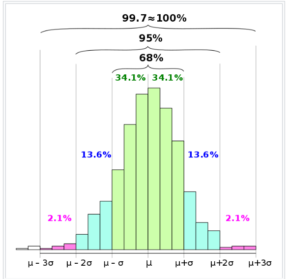

# Expected Frequency of S&P 500 Historical Returns vs Normal Distribution

### Black Swan events are rare and unpredictable outliers that are also referred to as “six sigma events”, meaning six standard deviation events. It is a concept of probabilistic risk modeling and is characterized by a price drop of six times the volatility (standard deviations) of an asset. Volatility is denoted by the lower case Greek letter σ (Sigma).
### A six sigma event assumes a 0.000000197% probability of occurrence. In other words once every 1.38 million years.

Image source: [Wikipedia](https://en.wikipedia.org/wiki/68%E2%80%9395%E2%80%9399.7_rule)

Source: [The Probability of Six Sigma Events](https://nox.im/posts/2021/1230/the-probability-of-six-sigma-events/)
#
## The Empirical Rule
### The empirical rule, sometimes called the 68-95-99.7 rule, says that for a random variable that is normally distributed, 68% of data falls within one standard deviation of the mean, 95% falls within two standard deviations of the mean, and 99.7% falls within three standard deviations of the mean.

Image source: [Wikipedia](https://en.wikipedia.org/wiki/68%E2%80%9395%E2%80%9399.7_rule)

Source: [The Normal Distribution](https://www.statology.org/the-normal-distribution/)

